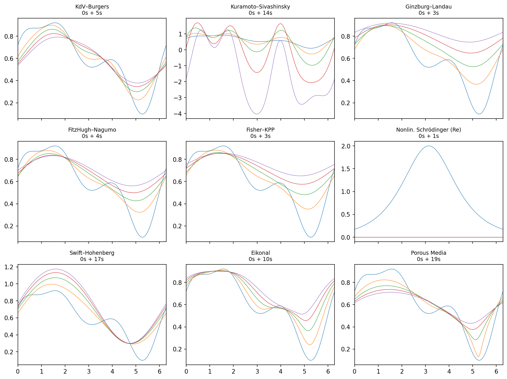

# opid — Operator Identification from PDE Trajectory Data

`opid` provides a sklearn-style API for identifying nonlinear PDE operators
from simulated or measured trajectory data.

## Installation

```bash
cd opid/
pip install -r requirements.txt
pip install -e .
```

For MILP support, `pyscipopt` and `cylp` are included in `requirements.txt`.

## Quick Start

```python
from opid import PDESimulator, FeatureLibrary, OperatorIdentifier

# 1. Simulate KdV: u_t = -6 u u_x - u_xxx
sim = PDESimulator.kdv(N=256, T=0.05, n_t=100, n_modes=8, seed=42)
U, U_t = sim.run()

# 2. Build a feature library
lib = FeatureLibrary(poly_degree=3, max_deriv=4, max_cross_degree=4)
Theta, names = lib.build(U)

# 3. Recover the operator
result = OperatorIdentifier(method="omp", n_nonzero=2).fit(Theta, U_t.ravel(), names)
print(result)
# → u_xxx: -1.00,  u u_x: -6.00
```

## Supported PDEs

| Factory method | Equation |
|----------------|----------|
| `PDESimulator.kdv()` | u_t = -6 u u_x - u_xxx |
| `PDESimulator.ks()` | u_t = -u u_x - u_xx - u_xxxx |
| `PDESimulator.burgers(nu=0.05)` | u_t = -u u_x + ν u_xx |
| `PDESimulator.allen_cahn(eps=0.01)` | u_t = ε u_xx + u - u³ |
| `PDESimulator.fisher_kpp(D=0.01, r=1.0)` | u_t = D u_xx + r u(1-u) |
| `PDESimulator.nls(sigma=1.0)` | i ψ_t + ψ_xx + σ\|ψ\|² ψ = 0 |
| `PDESimulator.custom(rhs_str)` | Arbitrary Mathematica-string RHS |

For coupled two-variable systems (u, v) such as NLS, Sine-Gordon, or
FitzHugh-Nagumo in first-order form, pass a two-tuple of RHS strings:

```python
# NLS: u_t = -v_xx - σ(u²+v²)v, v_t = u_xx + σ(u²+v²)u
sim = PDESimulator.custom(
    ("-D[D[v]] - 1.0*(u^2+v^2)*v", "D[D[u]] + 1.0*(u^2+v^2)*u"),
    name="NLS",
)
```

The RHS string syntax supports `D[u]` (first derivative), `Sin`, `Cos`,
`Exp`, `Log`, `Abs`, and arbitrary polynomial combinations of `u` and `v`.

All simulations use periodic boundary conditions on [0, 2π] with
FFTW-accelerated spectral integration (numpy fallback when g++/fftw3
are unavailable).

## Recovery Methods

| Method | Key | Description |
|--------|-----|-------------|
| OMP | `'omp'` | Orthogonal Matching Pursuit — fast, column-normalised |
| LassoCV | `'lasso'` | Column-normalised LassoCV with threshold truncation and OLS debiasing |
| L0 MILP | `'l0_pareto'` | Bisection-based MILP Pareto sweep with SCIP/CBC solvers |
| L0 SDP2 | `'l0_sdp2'` | Order-2 Lasserre SDP relaxation (P ≤ 9) |
| CCP | `'ccp'` | Correlation-cut pursuit — spectral-cluster OLS voting + OMP |

## Examples

### Benchmarking
```bash
python examples/bench_kdv.py          # KdV: J=1.00 all methods
python examples/bench_burgers.py      # Burgers: J=1.00 all methods
python examples/bench_allen_cahn.py   # Allen-Cahn: J=1.00 OMP + MILP + CCP
python examples/bench_ks.py           # KS: J=1.00 MILP + CCP
python examples/bench_fkpp.py         # FKPP: J=1.00 MILP + CCP
python examples/benchmark_all.py      # All seven PDEs
```

### B-spline Smoothing
```bash
python examples/bspline_smoothing.py   # Smooths noisy U before differentiation
```

## Feature Library

```python
lib = FeatureLibrary(
    poly_degree=3,        # max polynomial degree (u, u², u³)
    max_deriv=4,          # max spatial derivative order (u_xxxx)
    max_cross_degree=4,   # max total degree in cross-terms (e.g. u²·u_xx)
    include_constant=True,
    smooth=False,         # set True for B-spline pre-smoothing
    smooth_degree=5,      # B-spline polynomial degree
    smooth_n_knots=25,    # number of knot intervals
)
Theta, names = lib.build(U, k)
```

Spatial derivatives are computed via FFT (machine-precision on smooth data).
When `smooth=True`, each spatial snapshot is projected onto a B-spline
basis before differentiation, improving derivative quality for noisy data.

## Architecture

```
opid/
├── simulator.py    # PDESimulator — spectral PDE integrator
├── library.py      # FeatureLibrary — candidate term dictionary
├── recovery.py     # OperatorIdentifier — OMP / LassoCV / MILP / SDP2 / CCP
├── _backend/       # SpectralEngine — FFTW-accelerated solver
├── _bspline/       # B-spline design matrix (Cython extension)
├── utils.py        # add_noise, jaccard_score, print_recovery_table
└── examples/       # Usage examples
```

## Classical PDE Gallery

```bash
python examples/gallery.py     # generates docs/example.png
```



Solves 9 classical evolution equations (KdV-Burgers, KS, Ginzburg-Landau,
FitzHugh-Nagumo, Fisher-KPP, Nonlinear Schrödinger, Swift-Hohenberg, Eikonal,
Porous Media) on [0, 2π] and plots solution snapshots.

## Testing

```bash
python -m pytest tests/ -v
```
